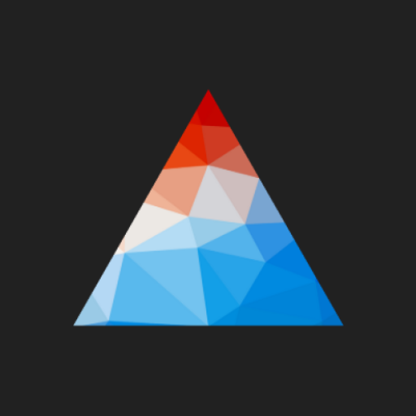

 

# Artista

Artista is an android app that harnesses the deep learning's style transfer technique to create elegant media on your smartphone, without any cloud services/internet.

Google Play and the Google Play logo are trademarks of Google LLC.

## Developed By

**Naveen Sahu**

Twitter - [@heyNvN](https://twitter.com/heyNvN)

## License

See [LICENSE](https://github.com/theNvN/Artista/blob/master/LICENSE)
